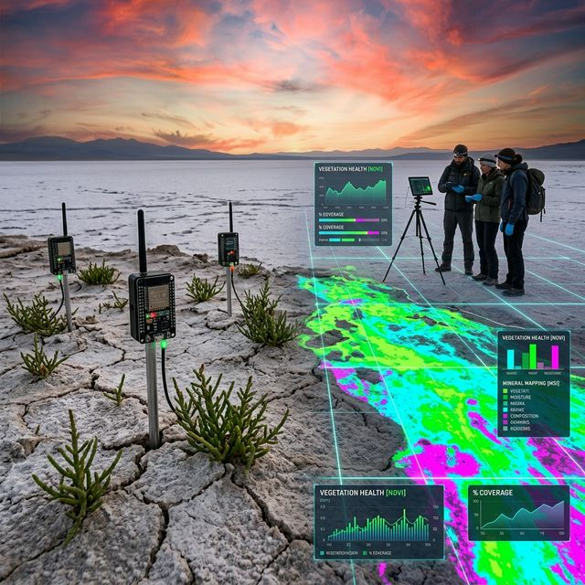

# 🛡️ KRİTİK-EŞİK-TUZGÖLÜ: Ekolojik Asimetri ve LCHI Tarım Manifestosu

> *"Doğa ile olan savaşımızda galip gelirsek, kaybedeceğiz. Bize gereken şey doğayı yenmek değil, onun asimetrik kurallarına düşük maliyetli, yüksek etkili (LCHI) ve akılcı bir tasarımla uyum sağlamaktır."*

## 📜 1. Felsefi Temel ve Doktrin: Neden Buradayız?
Tuz Gölü Havzası'nda yaşanan ekolojik kriz, basit bir kuraklık periyodu değil; toprağın, suyun ve insanın yanlış tasarlanmış hantal bir sisteme karşı verdiği yapısal bir çöküş savaşıdır. Geleneksel tarım politikaları, devasa bütçeli sulama projeleri ve doğanın sınırlarını zorlayan "pahalı" çözümler tamamen iflas etmiştir. 

Modern çatışma alanlarında nasıl ki milyar dolarlık devasa savunma sistemleri, bin dolarlık otonom dronlar ve asimetrik stratejiler karşısında çaresiz kalıyorsa; doğanın çölleşme taarruzuna karşı da milyarlık barajlar ve dev betonarme altyapılar yenilmeye mahkumdur. Bu krizden çıkış yolu, hantal ve pahalı sistemler üretmek değil; **Low-Cost-High-Impact (LCHI - Düşük Maliyetli, Yüksek Etkili)** ve akıllı tarım stratejilerini devreye sokmaktır. Etkili ve ucuz araçlar, sahayı domine edecektir.

Bu araştırma deposu; ekolojik bir savunma hattı kurmak için "Tasarım Yoluyla Güvenlik" (Security by Design) prensibini tarıma uyarlayan bir mühendislik, veri ve felsefe manifestosudur. Amacımız; minimum maliyetle, ekosisteme maksimum düzeyde uyum sağlayan otonom ve sürdürülebilir bir tarım mimarisi inşa etmektir.

---

## 🚨 2. Krizin Anatomisi: Geri Dönülemez Nokta

### 💧 2.1. Taktiksel Hata: Hidrolojik Tüketim ve Akifer Çöküşü
Havzadaki yeraltı suları, mısır ve şeker pancarı gibi bölgenin doğasına tamamen aykırı, su oburu bitkiler tarafından adeta "sömürülmektedir". 
* **Veri Yetersizliği:** Kapalı havzanın su bütçesi geleneksel yöntemlerle hesaplanamaz duruma gelmiştir.
* **Fiziksel Çöküş:** Su seviyesindeki yıllık 2-3 metrelik düşüşler, toprağın altındaki kireçtaşı mağaralarını boşaltarak devasa obruklara neden olmakta; sistemin çökmekte olduğunun fiziksel ve ölümcül kanıtlarını sunmaktadır.

### 🧂 2.2. Kimyasal Erozyon: Antropojenik Salinizasyon
Pahalı pompalarla binlerce metreden çekilen sularla yapılan yanlış ve aşırı sulama, toprağın derinliklerindeki bin yıllık tuzu yüzeye kusmasına neden olmuştur.
* **Albedo Etkisi:** Beyaz bir ölüm tabakası gibi tarlaları kaplayan bu tuz, güneş ışınlarını yansıtarak bölgenin mikro-klimasını daha da ısıtmaktadır.
* **Asimetrik Tehdit:** Kuruyan göl yatağından kalkan tuzlu tozlar, rüzgarla taşınarak kilometrelerce ötedeki sağlıklı tarım arazilerini de sessizce zehirleyen asimetrik bir silaha dönüşmüştür.

---

## ⚙️ 3. LCHI (Low-Cost-High-Impact) Çözüm Mimarisi

Pahalı altyapılar ve bürokratik projeler yerine; maliyeti asgari, zekası ve etkisi azami olan dağıtık mühendislik çözümleri:

### 🌱 A. Biyolojik Müdahale ve Asimetri: Halofit Doktrini
* **Taktik:** Toprağı tatlı suyla yıkamak gibi milyarlarca dolarlık, enerji tüketen ve imkansız bir projeye girişmek yerine; tuzu seven, onunla beslenen ve onu topraktan çeken bitkiler ekmek.
* **Uygulama:** *Salicornia* (Deniz börülcesi), *Kinoa* ve *Atriplex* gibi halofit türlerin fitoremediasyon (bitkisel iyileştirme) aracı olarak kullanılması. Maliyeti sadece tohumdur, ancak toprağı rehabilite etme ve ekonomik getiri sağlama (biyodizel, gıda, yem) etkisi devasadır. Doğanın silahını doğaya karşı kullanmaktır.

### 📡 B. Donanım Asimetrisi: Edge-AI ve Dağıtık IoT Ağları
* **Taktik:** Milyonluk merkezi meteoroloji istasyonları ve kablolu sensör ağları kurmak yerine; açık kaynaklı, dağıtık, bataryasız (solar) ve ucuz IoT düğümleri kullanmak.
* **Uygulama:** ESP32/Arduino tabanlı, LoRaWAN protokolü ile kilometrelerce öteye veri basabilen 5-10 dolarlık toprak nemi ve EC (tuzluluk) sensörlerinin on binlerce dönüm sahaya dağıtılması. Bu asimetrik veri ağı sayesinde, bitkinin sadece strese girdiği anlarda milimetrik su verilmesi ve su israfının %70 oranında kesilmesi hedeflenmektedir.

### 🧠 C. Veri ve Karar Destek: Uydu İstihbaratı ve Otonom Sistemler
* **Taktik:** Sürekli sahaya insan indirmek, dron uçurmak veya manuel ölçüm yapmak yerine; gökyüzündeki hazır ve ücretsiz veriyi (Satellite Intelligence) otonom ajanlarla işlemek.
* **Uygulama:** Sentinel-2 ve Landsat açık kaynak uydu verileri kullanılarak, Python tabanlı algoritmalarla otomatik NDVI (Bitki Sağlığı) ve NDWI (Su Endeksi) haritalarının çıkarılması. Sistemin, insan müdahalesine gerek kalmadan, kriz anında veya sulama eşiği aşıldığında sahadaki akıllı vanalara doğrudan komut göndermesi (Vibe Coding felsefesiyle sistemin kendi kendini yönetmesi).

---

## 🗺️ 4. Taktiksel Yol Haritası (Roadmap)

* **Faz 1: Veri Toplama ve Keşif (Reconnaissance)** * Havzanın son 20 yıllık uydu verilerinin işlenmesi ve geri dönülemez noktaların (obruk bölgeleri, aşırı tuzlanmış alanlar) haritalandırılması.
* **Faz 2: Açık Kaynak Donanım Dağıtımı (Deployment)**
  * LCHI prensibine uygun 10$ altı maliyetli sensör prototiplerinin tasarım dosyalarının (Gerber/PCB) yayınlanması ve pilot bölgelere yerleştirilmesi.
* **Faz 3: Biyolojik Taarruz (Bio-Intervention)**
  * Pilot tuzlu arazilerde halofit ekim simülasyonlarının yapılması ve büyüme verilerinin uydu/IoT ile eşzamanlı takibi.

---

## 📂 5. Repo Hiyerarşisi (Directory Structure)

```text
├── 📊 data/                
│   ├── raw_satellite/         # Sentinel-2 ham spektral verileri
│   ├── ground_truth_iot/      # Dağıtık LCHI sensörlerinden gelen telemetri
│   └── climate_baseline/      # 50 yıllık MGM sıcaklık/yağış referansları
├── 🔬 lchi_solutions/
│   ├── halophyte_manifesto.md # Tuzcul bitki üretim, genetik ve savunma rehberi
│   ├── open_sensor_hw/        # 10$ altı IoT sensör devre şemaları ve 3D kutu tasarımları
│   └── asymmetric_agri.md     # Kriz bölgeleri için ekonomik eylem planı
├── 💻 core_engine/
│   ├── sentinel_edge_calc.py  # Uydu verisinden su stresi tespit eden hafifletilmiş algoritma
│   ├── water_rationing_ai.py  # Otonom su kısıtlama optimizasyonu (Q-Learning)
│   └── firmware_esp32/        # Düşük güç tüketimli (Deep Sleep) sensör yazılımları
├── 🗺️ risk_maps/               # Coğrafi Bilgi Sistemleri (QGIS/ArcGIS) çıktıları
└── README.md
```

---

## 🚀 6. Katılım Protokolü (Açık Çağrı)

Bu projenin ve sistemin bir parçası olmak için devasa bütçelere, büyük araştırma laboratuvarlarına veya bürokratik izinlere ihtiyacınız yok; sadece pragmatik bir mühendislik zekasına ve "çözüm" odaklı bir iradeye ihtiyacınız var.

1.  **Donanım Geliştiricileri:** LCHI felsefesine uygun, daha ucuz, daha dayanıklı ve daha uzun pil ömürlü bir toprak sensörü tasarlayabiliyorsanız projeye Pull Request gönderin.
2.  **Yazılım ve Yapay Zeka Uzmanları:** Uydu verilerini daha düşük işlem gücüyle (Edge computing) işleyecek algoritmalar geliştirin; sistemi daha otonom hale getirin.
3.  **Ziraat Mühendisleri ve Biyologlar:** Geleneksel tarımın ezberlerini bozan, tuza dayanıklı yerel tohumları ve fitoremediasyon taktiklerini `lchi_solutions` kütüphanesine ekleyin.

> *"Tuz Gölü, bir kaybedişin ve çölleşmenin simgesi değil; doğanın asimetrik kurallarına uyum sağlayan yeni nesil hayatta kalma mühendisliğinin doğduğu sıfır noktası olacaktır."*
